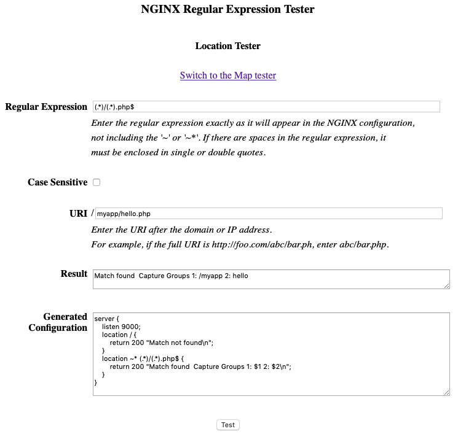
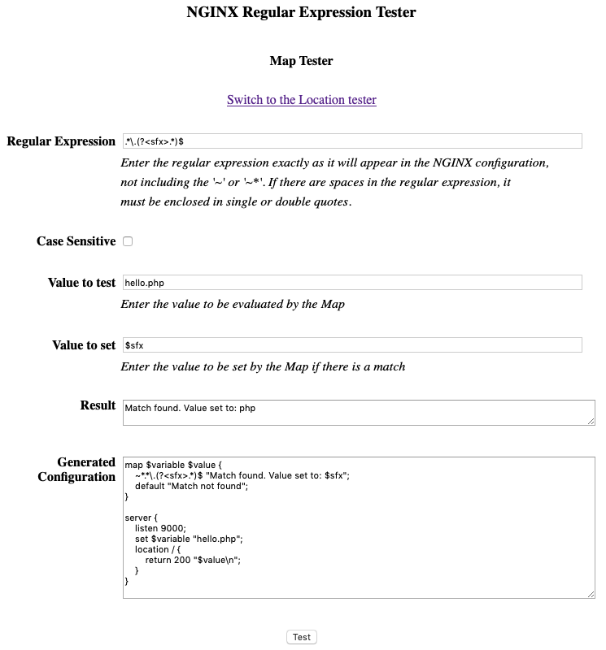

# Docker NGINX Regular Expression Tester

> Based on <https://github.com/nginxinc/NGINX-Demos/tree/master/nginx-regex-tester> and article [A Regular Expression Tester for NGINX and NGINX Plus](https://www.nginx.com/blog/regular-expression-tester-nginx/).

## Overview

Provides a mechanism for testing regular expressions directly within an NGINX
configuration.

NGINX Unit is used to serve a PHP page that creates an NGINX configuration to
use to test the regular expression.

NGINX and Unit are run together in the same container.

### Components

|            Component            |                                         Description                                         |
|---------------------------------|---------------------------------------------------------------------------------------------|
| `docker-compose.yml`            | The configuration file for Docker Compose to build the image and create the container.      |
| `/regextester/Dockerfile`       | Creates a Docker image, _regextester_ based on the NGINX F/OSS image and adding NGINX Unit. |
| `/regextester/regextester.conf` | The base NGINX configuration file for this application, proxying requests to NGINX Unit.    |

```nginx
upstream regextester {
    server 127.0.0.1:8000;
}

server {
    listen 80;

    location / { # Included so start.sh can see that NGINX is running
        root /usr/share/nginx/html;
    }

    location ~ \.php$ {
        proxy_pass http://regextester;
    }
}
```

**/regextester/regextester.php:** A page where the user chooses whether the
regular expression is for a location or map and then enteres the required
values. The necessary NGINX configuration is generated and NGINX is reloaded.
The regex is then tested and the results displayed.

The format of the NGINX configuration file to be generated depends on whether
the regex is to be used in a location or a map.

For a location it will be of the form:

```nginx
server {
    listen 9000;
    location / {
        return 200 "Match not found\n";
    }
    location ~ <regex> {
        return 200 "Match found [Capture Group(s) 1: $i 2: $i ...]\n";
    }
}
```

For example, if the regex is `(.*)/(.*).php$` and it is case insensitive the
generated configuration file will be:

```nginx
server {
    listen 9000;

    location / {
        return 200 "Match not found\n";
    }

    location ~* (.*)/(.*).php$ {
        return 200 "Match found. Capture Groups 1: $i 2: $2\n]";
    }
}
```

Here is a screen shot of the PHP page with the results for the URI _/myapp/hello.php_:



For a map, the NGINX configuration files will be of the form:

```nginx
 map $variable $value {
     ~[*]<regex> "Match found: <value to set>;
     default "No match found:";
 }

 server {
     listen 9000;

     set $variable "<value to set>";

     location / {
        return 200 "$value\n";
    }
 }
```

For example, if the regex is `\.php$`, the value to test is _hello.php_, the
value to set if a match is found is _php_ and it is case sensitive, the
generated configuration file will be:

```nginx
 map $variable $value {
     ~\.php$ "Match found. Value set to: php";
     default "No match found:";
 }

 server {
     listen 9000;

     set $variable "hello.php";

     location / {
        return 200 "$value\n";
    }
 }
```

If the regex is `.*\.(?<sfx>.*)$`, the value to test is _hello.php_, the value
to set if a match is found is _$sfx_ and it is case insensitive, the generated
configuration file will be:

```nginx
 map $variable $value {
     ~*.*\.(?<sfx>.*)$ "Match found. Value set to: $sfx";
     default "No match found:";
 }

 server {
     listen 9000;

     set $variable "hello.php";

     location / {
        return 200 "$value\n";
    }
 }
```

Here is a screen shot of the PHP page with the results:



- `/regextester/start.sh` - The start script specified in the Dockerfile to start NGINX and Unit and configure Unit.
- `/regextester/unitphp.config` - The Unit configuration.

## Usage

1. Run `docker-compose up -d` to build the image and start a container.
2. Open your web browser to <http://127.0.0.1/regextester.php>.
3. Enter required information then press the _Test_ button.
